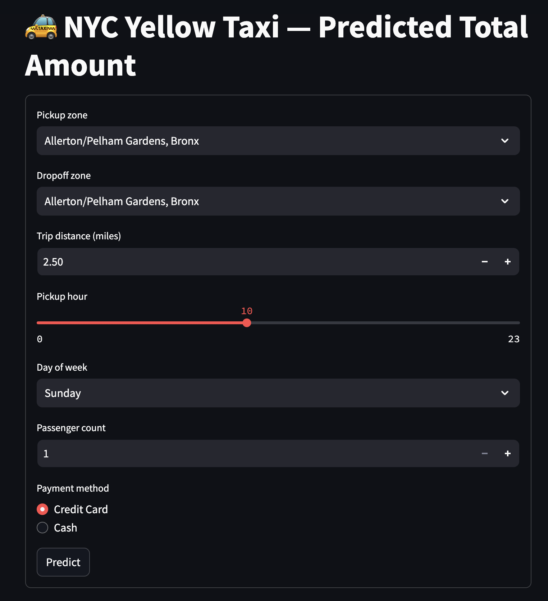

# CS-675 Final Project: NYC Yellow Taxi Analytics at Cloud Scale

A PySpark pipeline for the NYC Yellow Taxi dataset. It's developed and tested locally against a single-month slice in Docker, and can be deployed at full scale (2019–2022, ~180M rows) to AWS using Terraform, S3, Glue/Athena, and EMR Serverless. Includes preprocessing, exploratory analytics, an ML fare-prediction model, and a Streamlit UI for interactive predictions.

## Overview

The pipeline takes raw NYC Yellow Taxi trip records (pickup/dropoff time, location, distance, fare, tip, payment type, etc.), cleans and transforms them, then answers five research questions:

1. How does trip demand vary by hour of day and day of week?
2. Which pickup zones generate the most revenue and trips?
3. Does tipping behavior differ across trip distance buckets (short / medium / long)?
4. How does fare-per-mile vary across distance buckets — do short trips cost more per mile?
5. Does trip demand or average fare change on rainy or snowy days? (joined against NOAA daily weather — the project's cross-source join)

On top of that, a Spark ML pipeline trains and compares regression models to predict a trip's `total_amount`, and a Streamlit app lets you plug in trip details (zones, distance, time, passengers, payment method) to get a live fare prediction plus the analytics results, all served from the trained model.

The same PySpark code runs two ways: locally in Docker against a ~3M-row single-month slice for fast iteration, and on AWS (S3 + Glue/Athena + EMR Serverless, provisioned via Terraform) against the full ~180M-row 2019–2022 dataset.

## Preprocessing: Before → After

`work/preprocess_steps.py` runs six transforms — imputation, outlier removal, normalization, encoding, and two binning steps — shared unchanged between the local and cloud paths. Numbers below are measured, not estimated: the local figures come from reading `data/taxi/yellow_2022-01.parquet` and `data/output/taxi_clean/` directly; the full-scale raw count comes from summing the row-count metadata of all 48 source Parquet files (2019-01 → 2022-12) at the TLC CloudFront URLs in [Data Source](#data-source); the full-scale clean count is the actual EMR Serverless run recorded in [`analytics_results.md`](analytics_results.md).

**Row-level impact**

| Scope | Raw rows | Rows after preprocessing | Dropped | Drop rate |
|---|---|---|---|---|
| Local sample (Jan 2022) | 2,463,931 | 2,423,252 | 40,679 | 1.65% |
| Full dataset (2019–2022, cloud) | 179,807,942 | 177,174,900 | 2,633,042 | 1.46% |

Only outlier removal drops rows; imputation, normalization, encoding, and binning transform values in place. (Note: the true 2019–2022 Yellow Taxi volume is ~180M rows — earlier planning docs and the scope-review slides had estimated ~260M; this README uses the measured figure.)

**Step-by-step justification** (measured on the Jan 2022 local sample)

| Step | Function | Before | After | Rationale |
|---|---|---|---|---|
| Imputation | `impute()` | `passenger_count` null: 71,503 (2.90%) | filled with `1` | Solo rider is the modal value; a count field isn't a good candidate for mean/median imputation |
| Imputation | `impute()` | `fare_amount` null: 0 (0.00% in this slice) | rows dropped if present | Primary ML target — can't be meaningfully imputed, so nulls are excluded rather than guessed |
| Outlier removal | `remove_outliers()` | `trip_distance` ≤ 0: 29,373 rows (1.19%) | dropped | Zero/negative distance is a sensor or logging error, not a real trip |
| Outlier removal | `remove_outliers()` | `fare_amount` < 0: 12,733 rows (0.52%) | dropped | Negative fares are refund/adjustment records, not trip cost |
| Outlier removal | `remove_outliers()` | `total_amount` < 0: 12,934 rows (0.52%) | dropped | Same as above |
| Outlier removal | `remove_outliers()` | `fare_amount` max $401,092.32 (9 rows > $500) | capped at $500 | Legitimate fares top out near JFK's ~$70 flat rate; uncapped, these 9 corrupt rows dominate squared-error loss in GBT/RF |
| Outlier removal | `remove_outliers()` | `total_amount` max $401,095.62 (9 rows > $600) | capped at $600 | Same corrupt rows, capped with headroom for tip on top of fare |
| Normalization | `normalize()` | `fare_amount`, `trip_distance` on raw dollar/mile scale | min-max scaled to [0, 1] (`fare_norm`, `dist_norm`) | Puts fare and distance on a comparable scale and enables cross-year comparison |
| Encoding | `encode()` | `payment_type` int, 6 distinct codes (96.66% are 1/2/3) | one-hot flags `pay_credit_card` / `pay_cash` / `pay_no_charge` | Converts categorical codes to numeric features; the remaining 3.34% (voided/other codes) intentionally map to all-zero rather than inventing a 4th bucket |
| Binning | `bin_distance()` | `trip_distance` continuous, 0–306,159 mi | `distance_bucket`: short (<1mi) / medium (1–10mi) / long (>10mi) | Buckets align with TLC's own fare-tier breakpoints; used throughout Q3/Q4 |
| Binning | `bin_time_of_day()` | `pickup_hour` 0–23 | `time_of_day`: overnight / morning / afternoon / evening / night | Groups hours into behaviorally meaningful segments (commute vs. leisure vs. late-night) |

## Cross-Source Join: Weather (Q5)

`work/weather_helpers.py` loads NOAA GHCN-Daily daily weather for NYC (Central Park station `USW00094728`) and buckets each day into `clear` / `rain` / `snow`. `query_demand_by_weather()` in `work/analytics.py` joins this against the cleaned taxi trips on `pickup_date`, broadcasting the weather side (~1,461 rows) against the taxi fact table (177M+ rows) to avoid a shuffle — a standard big-data join pattern for a large-fact/small-dimension join.

Runs both locally (`make download-weather` before `make run-analytics`, on the Jan 2022 dev slice) and at full cloud scale via `cloud/03_analytics_cloud.py` on EMR Serverless — the numbers in [`analytics_results.md`](analytics_results.md) are from the full 2019–2022, 177M+ trip cloud run, joined against 4 years of daily weather. Results: [`results/q5_weather_demand.csv`](results/q5_weather_demand.csv).

## Data Source

Raw trip data is the public **NYC TLC Yellow Taxi Trip Records**, published by the NYC Taxi & Limousine Commission:

- Official dataset page: https://www.nyc.gov/site/tlc/about/tlc-trip-record-data.page
- Raw Parquet files (used by `scripts/download_full_data.sh`): `https://d37ci6vzurychx.cloudfront.net/trip-data/yellow_tripdata_YYYY-MM.parquet`
- Taxi zone lookup table (used by `scripts/download_zone_lookup.sh`): https://d37ci6vzurychx.cloudfront.net/misc/taxi_zone_lookup.csv
- Daily weather (used by `scripts/download_weather.sh`): NOAA GHCN-Daily, NYC Central Park station (`USW00094728`) — `https://www.ncei.noaa.gov/data/global-historical-climatology-network-daily/access/USW00094728.csv`

`make download-data` / `make download-zones` / `make download-weather` (local) and `scripts/download_full_data.sh` (cloud) fetch these directly — no manual download needed.

## Prerequisites

**For local development:**
- Docker and Docker Compose
- `make`
- `curl`

**For cloud deployment (optional):**
- An AWS account with credentials configured (e.g. `aws configure --profile ds`)
- [Terraform](https://developer.hashicorp.com/terraform) >= 1.5
- AWS CLI v2

Python dependencies (`pyspark`, `pytest`, `streamlit`, `pandas` — see `pyproject.toml`) are installed automatically inside the Docker container; you don't need a local Python environment to run the pipeline or tests.

## Local Setup

1. **Start the environment**

   ```bash
   make up
   ```

   This starts two containers via `docker-compose.yml`:
   - `pyspark` — a Jupyter + PySpark 3.5 notebook server, with `work/`, `tests/`, `data/`, `ui/`, and `results/` mounted in, and installs `pytest`/`streamlit` on startup
   - `history` — a Spark History Server reading event logs from `spark-events/`

   Ports exposed: `4040` (Spark UI), `18080`/`18081` (history servers), `8501` (Streamlit).

2. **Download the data**

   ```bash
   make download-data    # one month (2022-01) of Yellow Taxi trip data, for local dev
   make download-zones   # taxi zone lookup table (LocationID -> Borough/Zone)
   make download-weather # NOAA daily weather for NYC (Central Park station), for Q5
   ```

3. **Run the pipeline** (each step runs inside the `pyspark` container):

   ```bash
   make run-explore     # profile raw schema, row counts, null counts
   make run-preprocess  # clean + transform data (work/02_preprocess.py)
   make run-analytics   # run the 5 analytical queries, write results/*.csv
   make run-ml          # train models, write best model + metrics to data/output/models/
   ```

   Trained models (LR/RF/GBT) and `metrics.json` are also committed under `data/output/models/` so the prediction UI works out of the box without re-running `make run-ml`.

4. **Run the tests**

   ```bash
   make test
   ```

5. **Stop the environment**

   ```bash
   make down
   ```

## Run the Prediction UI

Prerequisites: models must already be trained (`make run-ml`) and the zone lookup downloaded (`make download-zones`).

```bash
make run-ui
```

Open http://localhost:8501, fill in trip details, and click "Predict" to see the estimated `total_amount` from the best-performing trained model. The page also shows the analytics results (tables + charts) from the queries run in `make run-analytics`.



## Cloud Deployment (AWS)

The same PySpark logic (`work/preprocess_steps.py`, `work/analytics.py`, `work/ml_features.py`) runs against `s3://` paths via the `cloud/*_cloud.py` entry points, switched on by setting `CS675_ENV=cloud`.

1. **Provision infrastructure**

   ```bash
   cd infrastructure
   terraform init
   terraform apply -var="student_id=<your-id>"
   ```

   This creates an S3 bucket, an Athena workgroup + Glue database/table (partitioned by year/month), and an EMR Serverless Spark application (see `infrastructure/main.tf`, `glue_taxi.tf`, `iam_emr.tf`).

2. **Upload the full dataset to S3**

   ```bash
   export CS675_BUCKET=<bucket-name-from-terraform-output>
   export AWS_PROFILE=ds   # or your configured profile
   ./scripts/download_full_data.sh
   ```

   Downloads and uploads 48 months (2019–2022) of Yellow Taxi Parquet files to `s3://$CS675_BUCKET/data/taxi/year=YYYY/month=MM/`.

   `scripts/download_weather.sh` similarly uploads `data/weather_central_park.csv` to `s3://$CS675_BUCKET/data/weather_central_park.csv` whenever `CS675_BUCKET` is set — required for `cloud/03_analytics_cloud.py`'s Q5 join to find the file.

3. **Submit a job to EMR Serverless**

   ```bash
   ./cloud/emr_job_runner.sh 02_preprocess_cloud
   ./cloud/emr_job_runner.sh 03_analytics_cloud
   ./cloud/emr_job_runner.sh 04_ml_cloud
   ```

   Each invocation uploads the entry script plus shared helper modules to S3, submits a Spark job via `aws emr-serverless start-job-run`, and polls until it completes. Logs land at `s3://$CS675_BUCKET/emr-logs/`.

## Project Structure

| Path | Description |
|------|-------------|
| `docker-compose.yml`, `Makefile`, `pyproject.toml` | Local dev environment and lifecycle commands |
| `work/` | Core pipeline logic: preprocessing, analytics, ML features, Spark helpers — used both locally and in the cloud |
| `cloud/` | Cloud-path entry points (reading/writing `s3://`) and the EMR Serverless job runner |
| `ui/` | Streamlit prediction app and analytics display components |
| `infrastructure/` | Terraform config for S3, Glue/Athena, EMR Serverless, IAM |
| `scripts/` | Data/zone-lookup download helpers |
| `tests/` | Pytest unit tests (Spark fixture in `conftest.py`) |
| `results/` | Output CSVs from the 5 analytical queries |
| `data/` | Local dataset storage (gitignored) |
| `plan.md`, `ml.md`, `analytics_results.md`, `presentation.md` | Design notes, ML write-up, results summary, presentation script |

## Environment Variables

| Variable | Purpose | Default |
|----------|---------|---------|
| `CS675_ENV` | Set to `cloud` to switch data paths from local to S3 | unset (local) |
| `CS675_BUCKET` | S3 bucket name used for cloud data/output paths and job submission | `ds-student-workspace` |
| `AWS_PROFILE` | AWS CLI profile used by cloud scripts | `ds` |
| `EMR_ROLE_ARN` | Override the EMR execution role ARN (otherwise read from Terraform output) | Terraform output |
